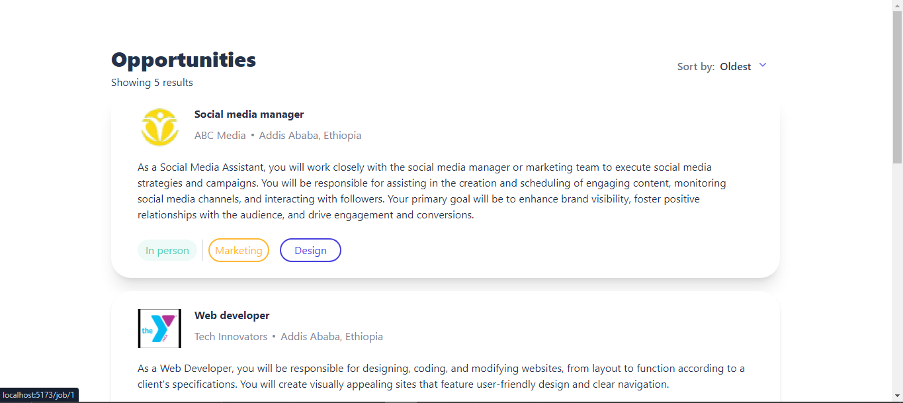

# Job Listing Application

This is a React-based job listing application that allows users to view job listings and detailed job descriptions. The app uses Tailwind CSS for styling and TypeScript for type safety. It features routing to navigate between the homepage and job description pages.

## Table of Contents

- [Features](#features)
- [Installation](#installation)
- [Usage](#usage)
- [Project Structure](#project-structure)
- [Technologies Used](#technologies-used)
- [Screenshots](#screenshots)

## Features

- **Home Page**: Displays a list of job cards.
- **Job Details Page**: Provides detailed information about a job, including the job description, requirements, and other relevant details.
- **Responsive Design**: The application is responsive and works on different screen sizes.

## Installation

1. **Clone the repository**:
    ```bash
    git clone https://github.com/SalasDelil/jobs-portal.git
    cd job-listing-app
    ```

2. **Install dependencies**:
    ```bash
    npm install
    ```

3. **Start the development server**:
    ```bash
    npm run dev
    ```

    The app will be available at [http://localhost:5173](http://localhost:5173).

## Usage

- **View Job Listings**: Navigate to the home page to see all available job listings.
- **View Job Details**: Click on any job card to view the detailed job description.

## Project Structure

```plaintext
├── assets
│   ├── job1.jpg
│   ├── job2.jpg
│   └── ...
├── src
│   ├── assets
│   ├── components
│   │   ├── JobCard.tsx
│   │   ├── Dashboard.tsx
│   │   ├── JobDescription.tsx
│   │   ├── LandingPage.tsx
│   │   └── Sidebar.tsx
│   ├── posts
│   │   ├── Posts.tsx
│   │   ├── jobs.json
│   ├── App.tsx
│   ├── index.tsx
│   └── ...
├── .gitignore
├── package.json
├── README.md
└── tsconfig.json
```

## Technologies Used

**React**: JavaScript library for building user interfaces.
**TypeScript**: Typed superset of JavaScript that compiles to plain JavaScript.
**React Router**: Routing library for React applications.
**Tailwind CSS**: Utility-first CSS framework for styling.
**Node.js**: JavaScript runtime for server-side development.
**Vite**: Next-generation frontend tooling for fast builds and development.

## Screenshots

### Landing page for the Jobs listing application, press to see the description.


### Description page for the selected job with specifications and calendar


